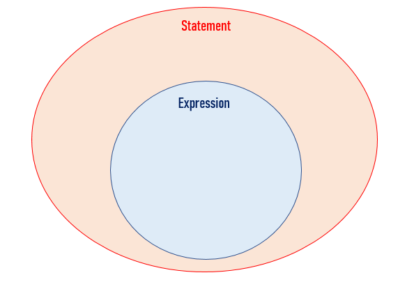

# 자바스크립트 3. 표현식 vs 문장
> [패스트 캠퍼스 프론트엔드 입문 강의 (자바스크립트)](https://www.fastcampus.co.kr/)

## Expression

자바스크립트에서 표현식은 value를 reuturn하는 것을 의미한다. 단순히 value도 될 수 있고 function을 통해서 반환하는 value일 수도 있다.

```js
1 + 1 // expression

function add(a, b){
  return a+b;
}
const ab = add(1,2); // expression
```

## Statement

프로그램에서 실행 가능한 최소의 독립적인 코드 조각을 일컫는다. 모든 코드 한 줄이나 블록은 statement라고 할 수 있다. 

```js
for(var i = 0; i < 10; i++){ 
} // statement 

while(true){ 

} // statement 

if(true){ 

} // statement
```
위와 같이 특별히 반환하는 value와 상관없는 if, for, while 등등을 Statment라고 한다. 반환하는 value가 없기 때문에 변수에 저장할 수도, 함수의 인수로 들어갈 수도 없다. 

**결국 모든 Expression은 Statement이지만, 모든 Statement가 Expression은 아니다.**



예를 들어서 '1+2'는 평가 가능한 Expression이지만, 동시에 실행이 가능한 구문이기도 하다. 즉, 모든 Expression은 Statement이다. 반면에 어떤 Statement는 Expression이지 않은데, 'return 2' 같은 경우 '2를 반환한다'는 의미일 뿐, 실제로 평가해서 2라는 값을 산출하지 않는다. 