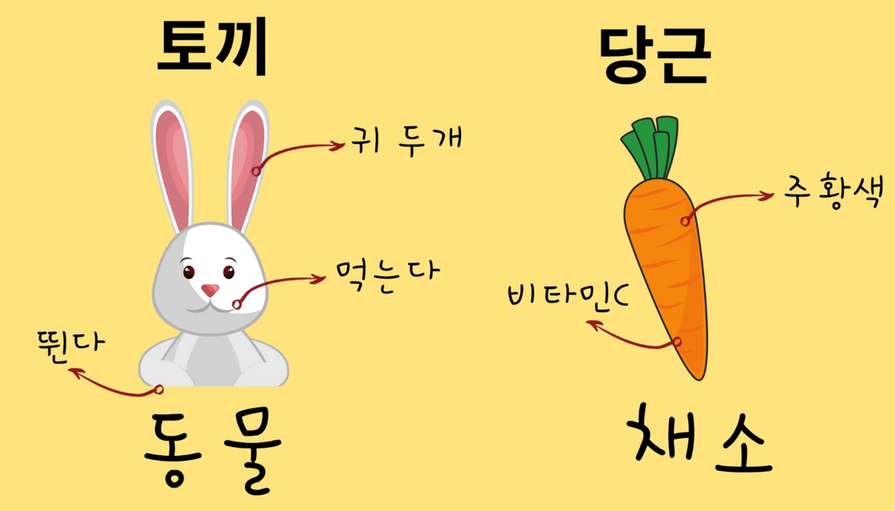
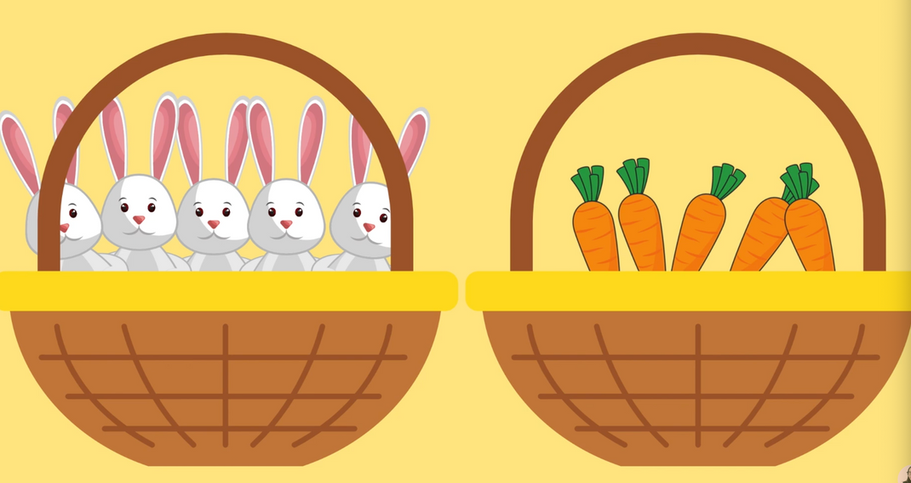

# Array 배열

> 드림코딩 강의로 선회하여 강의 노트를 정리



🐰 : 토끼라는 '오브젝트'는 귀 두 개, 동물이라는 프로퍼티와 먹는다와 같은 메서드로 구성되어 있다.

🥕 : 당근이라는 '오브젝트'는 채소, 주황색, 비타민 C라는 프로퍼티로 구성되어 있으며 오브젝트는 당근처럼 프로퍼티만 존재하고, 메서드는 없을 수도 있다.



위의 사진처럼 🐰와 🥕을 🧺 안에 정리해서 보다 효율적이고 체계적으로 관리할 수 있는데, 이렇게 비슷한 것들끼리 🧺 안에 묶어서 관리하는 것을 프로그래밍 언어에서는 자료구조 📚라고 한다.

자료구조(data structure)에는 어떤 방식으로 어떤 형식으로 데이터를 담느냐에 따라서 다양한 방법이 존재한다. (Array, Tuple, Linked list, Hash table 등)

자료구조를 충분히 이해하고, 그에 따라서 프로그래밍을 한다면 좋은 소프트웨어를 만들 수 있을 것이다.

## 1. 선언

```js
const arr1 = new Array();
const arr2 = [1, 2];
```

## 2. 접근

```js
const fruits = ["사과", "오렌지", "자두"];
alert(fruits[0]); // 사과
alert(fruits[1]); // 오렌지
alert(fruits[2]); // 자두
```

위와 같은 방법으로 요소를 수정할 수도 있다.

```js
fruits[2] = "배"; // 배열이 ["사과", "오렌지", "배"]로 바뀜
```

요소를 추가할 수도 있다.

```js
fruits[3] = "레몬"; // 배열이 ["사과", "오렌지", "배", "레몬"]으로 바뀜
```

`length`를 사용하면 배열에 담긴 요소의 개수를 알 수 있다.

```js
let fruits = ["사과", "오렌지", "자두"];

alert(fruits.length); // 3
```

**배열 요소의 자료형엔 제약이 없다.**

```js
// 요소에 여러 가지 자료형이 섞여 있습니다.
let arr = [
  "사과",
  { name: "이보라" },
  true,
  function () {
    alert("안녕하세요.");
  },
];

// 인덱스가 1인 요소(객체)의 name 프로퍼티를 출력합니다.
alert(arr[1].name); // 이보라

// 인덱스가 3인 요소(함수)를 실행합니다.
arr[3](); // 안녕하세요
```

## 배열의 요소 추가·제거 메서드

> **pop**

배열 끝 요소를 제거하고, 제거한 요소를 반환한다.

```js
let fruits = ["사과", "오렌지", "배"];

alert(fruits.pop()); // 배열에서 "배"를 제거하고 제거된 요소를 얼럿창에 띄웁니다.
alert(fruits); // 사과,오렌지
```

> **push**

배열 끝에 요소를 추가할 수 있다.

```js
let fruits = ["사과", "오렌지"];
fruits.push("배");
alert(fruits); // 사과, 오렌지, 배
```

> **shift**

배열의 앞 요소를 제거하고, 제거한 요소를 반환한다.

```js
let fruits = ["사과", "오렌지", "배"];

alert(fruits.shift()); // 배열에서 "사과"를 제거하고 제거된 요소를 얼럿창에 띄웁니다.

alert(fruits); // 오렌지,배
```

> **unshift**

배열의 앞에 요소를 추가한다.

```js
let fruits = ["오렌지", "배"];

fruits.unshift("사과");

alert(fruits); // 사과,오렌지,배
```

아래와 같이 요소 여러 개를 한 번에 더할 수도 있다.

```js
let fruits = ["사과"];

fruits.push("오렌지", "배");
fruits.unshift("파인애플", "레몬");

// ["파인애플", "레몬", "사과", "오렌지", "배"]
alert(fruits);
```

## shift와 unshift는 pop과 push보다 느리다.

> **concat**

배열을 묶어서 새로운 배열을 만들 수 있다.

```js
const fruit = ["사과", "배", "바나나"];
const fruits2 = ["귤", "감", "참외"];
const newFruits = fruit.concat(fruits2);
console.log(newFruits);

// [ '사과', '배', '바나나', '귤', '감', '참외' ]
```

> **splice**

`arr.splice`는 만능 스위스 맥가이버 칼 같은 메서드이다. 요소를 자유자재로 다룰 수 있게 해주는데, 이 메서드를 사용하면 요소 추가, 삭제, 교체가 모두 가능하다.

```js
arr.splice(index[, deleteCount, elem1, ..., elemN])
```

- 첫 번째 매개변수는 조작을 가할 첫 번째 요소를 가리키는 `인덱스(index)이다.`
- 두 번째 매개변수는 `deleteCount`로 제거하고자 하는 요소의 개수를 나타낸다.
- `elem1, ..., elemN`은 배열에 추가할 요소를 나타낸다.

**삭제**

```js
let arr = ["I", "study", "JavaScript"];
arr.splice(1, 1); // 인덱스 1로부터 요소 한 개를 제거
console.log(arr); // ["I", "JavaSript"]
```

- 인덱스 `1`이 가리키는 요소부터 시작해서 요소 한 개`(1)`를 지웠다.

```js
let arr = ["I", "study", "JavaScript", "right", "now"];
arr.splice(0, 3, "Let's", "dance"); // 처음(0)부터 시작해서 세 개(3)의 요소를 지우고, 이 자리를 다른 요소로 대체하겠다.
console.log(arr); // [ "Let's", 'dance', 'right', 'now' ]
```

- 요소 세 개를 지우고, 그 자리를 다른 요소로 `교체`했다.
- `deleteCount`를 `0`으로 설정하면 요소를 제거하지 않으면서 새로운 요소를 추가할 수 있다.

> **slice**

```js
arr.slice([start], [end]);
```

`arr.splice`와 유사해 보이지만, 훨씬 간단하다. `start` 인덱스부터 (`end`를 제외한) `end` 인덱스까지의 요소를 복사한 새로운 배열을 반환한다.

```js
let arr = ["t", "e", "s", "t"];
console.log(arr.slice(1, 3)); // [ 'e', 's' ]
```

- `arr.slice()`는 인수를 하나도 넘기지 않고 호출하여 `arr`의 복사본을 만들 수 있다. 기존의 배열을 건드리지 않으면서 배열을 조작하여 새로운 배열을 만들 때 자주 사용된다.

> **filter**

`filter` 메서드는 함수의 반환 값을 `true`로 만드는 단 하나의 요소를 만든다. 충족하는 요소가 여러 개라면 `arr.filter(fn)`을 사용하면 된다.

```js
let results = arr.filter(function (item, index, array) {
  // 조건을 충족하는 요소는 results에 순차적으로 더해진다.
  // 조건을 충족하는 요소가 하나도 없으면 빈 배열이 반환된다.
});
```

```js
let users = [
  { id: 1, name: "John" },
  { id: 2, name: "Pete" },
  { id: 3, name: "Mary" },
];

// 앞쪽 사용자 두 명을 반환합니다.
let someUsers = users.filter((item) => item.id < 3);

alert(someUsers.length); // 2
```

# 배열을 변형하는 메서드

> **map**

`arr.map`은 사용 빈도가 아주 높은 메서드이다. `map`은 배열 요소 `전체`를 대상으로 함수를 호출하고, 함수 `호출 결과`를 반환해준다.

```js
let result = arr.map(function (item, index, array) {
  // 요소 대신 새로운 값을 반환한다.
});
```

아래 예시는 각 요소의 길이를 출력하는 것이다.

```js
let lengths = ["Bilbo", "Gandalf", "Nazgul"].map((item) => item.length);
console.log(lengths); // [ 5, 7, 6 ]
```

> **split**

메세지 애플리케이션을 만들고 있다고 가정해 보자. 수신자가 여러 명일 경우, 발신자는 쉼표로 각 수신자를 구분할 것이다. `성현`, `두성`, `도현`처럼 말이다. 이럴 때 `split`을 사용하면 입력받은 문자열을 쉽게 배열로 바꿀 수 있다.

`str.split(delim)` / 구분자(delimiter) `delim`을 기준으로 문자열을 쪼개준다.

아래 예시에선 쉼표와 공백을 합친 문자열이 구분되는 기준이다.

```js
let names = "Bilbo, Gandalf, Nazgul";

let arr = names.split(", ");

for (let name of arr) {
  console.log(`${name}에게 보내는 메시지`);
  // 'Bilbo에게 보내는 메시지'
  //'Gandalf에게 보내는 메시지'
  //'Nazgul에게 보내는 메시지'
}
```

번외 ) 문자열을 글자 단위로 분리하기

```js
let str = "test";
console.log(str.split("")); // t, e, s, t
//빈 문자열로 지정
```

> **join**
>
> `arr.join(glue)`은 `split`과 반대 역할을 하는 메서드이다. 인수 `gule`를 접착체처럼 사용해 배열 요소를 모두 합친 후 하나의 `문자열`을 만들어준다.

```js
let arr = ["Blibo", "Gandalf", "Nazgul"];
let str = arr.join(";"); // 배열 요소 모두를 ;를 사용해 하나의 문자열로 합친다.
console.log(str); // Blibo;Gandalf;Nazgul;
```

## Looping

> ### for loop

```js
let fruits = ["사과", "오렌지", "배"];

for (let i = 0; i < fruits.length; i++) {
  console.log(fruits[i]);
}
//사과
//오렌지
//배
// for문의 조건이 충족되면 다음식으로 넘어간다.
```

> ### for of

```js
let fruits = ["사과", "오렌지", "배"];

for (let fruit of fruits) {
  console.log(fruit);
}
//사과
//오렌지
//배
```

### for each

```js
fruits.forEach(function (fruit, index, array) {
  console.log(fruit, index, array);
});
//'사과' 0 [ '사과', '오렌지', '배' ]
// '오렌지' 1 [ '사과', '오렌지', '배' ]
// '배' 2 [ '사과', '오렌지', '배' ]
```

익명 함수는 화살표 함수로 표현할 수 있으므로 아래와 같다.

```js
fruits.forEach((fruit) => console.log(fruit));
// 사과
// 오렌지
// 배
```

> forEach는 배열 안에 들어있는 값마다 내가 전달한 함수를 출력한다.
