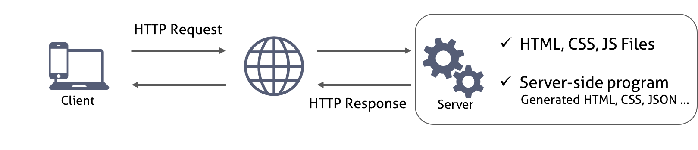
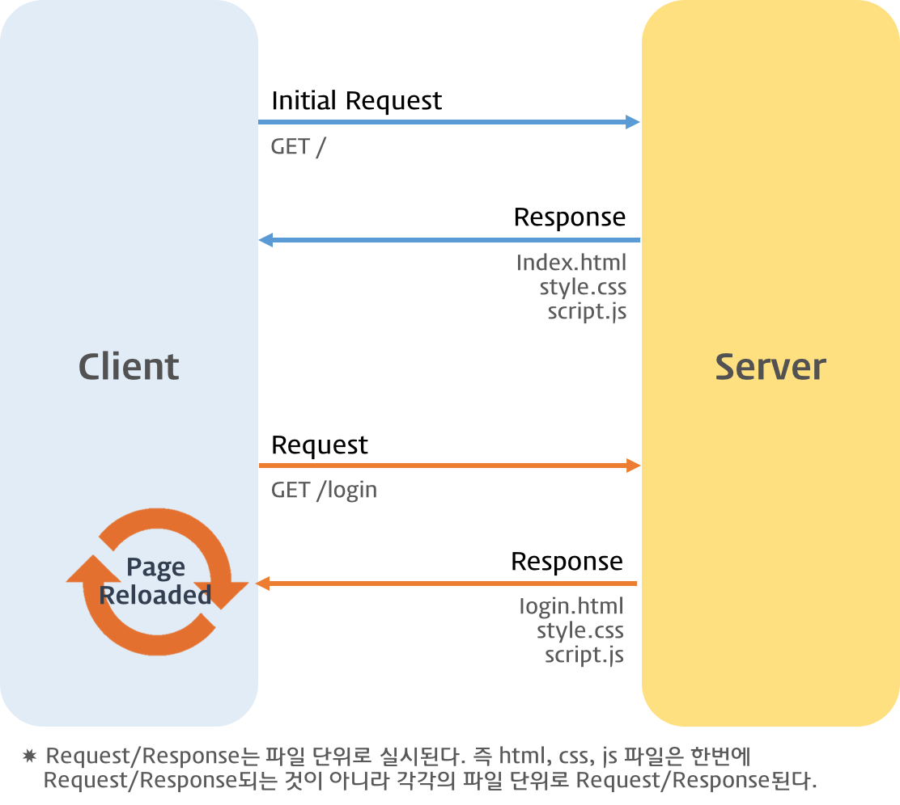

# JSON

브라우저에서 웹페이지를 이동하거나 링크를 클릭하면 화면 전환이 발생한다. 이것은 `브라우저`와 `서버`와의 통신에 의한 것이다.



서버는 요청받은 페이지(HTML)를 반환하는데 이때 HTML 파일과 연결된 CSS와 JS 파일도 함께 반환된다.

클라이언트의 요청에 따라서 서버는 `정적`인 파일을 반환할 수도 있고 서버 사이드 프로그램이 만들어낸 파일이나 데이터(JSON 등)를 반환할 수도 있다. 서버로부터 웹페이지가 반환되면 클라이언트(브라우저)는 이를 `렌더링`하여 화면에 표시한다.



**Ajax**(**Asynchronous** JavaScript and XML)란 자바스크립트를 이용하여 비동기적(Asynchronous)으로 HTTP 통신을 하는 기술이다.

- AJAX
  - XMLHttpRequest
  - fetch() API
  - **JSON**
    - 데이터를 주고받을 때 사용할 수 있는 가장 간단한 파일 포맷이다.
    - 텍스트를 기반으로 하기 때문에 읽기 쉬우며 용량이 적다. XML을 대체해서 JSON이 데이터 전송 등에 많이 사용되고 있다.
    - 브라우저뿐만 아니라, 모바일 서버와도 데이터를 주고받을 수 있다.
    - **key-value** 한 쌍으로 이루어져 있다.
    - **다수의 프로그래밍 환경에서 제공된다.** (객체를 **직렬화**하기 때문에)
      - cf. 직렬화란 컴퓨터 메모리 속에 있는 객체를 똑같은 객체로 환원할 수 있는 문자열로 변환하는 과정을 말함.

> ## 표기 방법

JSON의 포맷은 자바스크립트의 리터럴 표기법에 기반을 두고 있다.

**자바스크립트 객체 리터럴**

```js
{ name: "jeon", age: 27, marriage: false, data : [2, 5, null] };
```

**JSON 데이터로 변환**

위의 객체 리터럴을 JSON 데이터로 바꾸면 다음과 같다.

```JS
'{"name" : "Tom", "age":17, "marriage":false, "data":[2, 5, null]}'
```

- 객체의 `프로퍼티` 이름은 `큰따옴표`로 묶은 문자열로 표현한다.
  - 자바스크립트의 null, number, string, array, object, boolean 데이터 타입을 지원한다.
  - 객체의 중첩이 가능하다.
- JSON 데이터는 그 전체를 `작은따옴표`로 묶은 문자열이다.

# JSON의 반환과 환원

## JSON.stringify

> 해당 메서드는 인수로 받은 객체를 JSON 데이터로 바꾸어 반환한다.

```js
JSON.stringify(value[, replacer[, space]])
```

- value : JSON 문자열로 반환할 객체
- replacer(optional) : key & vlalue
- space(optional) : 출력하는 문자열 구분을 위한 공백 문자

```js
const rabbit = {
  name: "tori",
  color: "white",
  size: null,
  birthDate: new Date(),
  symbol: Symbol("id"),
  jump: () => {
    console.log(`${name} can jump!`);
  },
};
json = JSON.stringify(rabbit);
console.log(json);
// {"name":"tori","color":"white","size":null,"birthDate":"2021-01-21T10:48:43.445Z"}
```

- Fuction, RegExp, Error 객체, undefined, 심벌은 직렬화할 수 없다. (JSON 변환 불가)
- Date 객체는 iSO 포맷의 날짜 문자열로 직렬화된다. (단, JSON.parse는 문자열을 그대로 출력함.)

아래와 같이 콜백 함수를 사용해서 세밀하게 JSON 데이터에 접근할 수 있다.

```js
json = JSON.stringify(rabbit, (key, value) => {
  console.log(`key:${key}, value:${value}`);
  return key === "name" ? "ellie" : value;
});
console.log(json);
// {"name":"ellie","color":"white","size":null,"birthDate":"2021-01-21T11:23:32.438Z"}
```

## JSON.parse

> 해당 메서드는 인수로 받은 문자열을 자바스크립트 객체로 환원해서 반환한다.

```js
JSON.parse(text[, reviver])
```

- text : 자바스크립트의 객체로 환원하고자 하는 JSON 문자열을 지정
- reviver(optional) : key & value

```js
json = JSON.stringify(rabbit);
const obj = JSON.parse(json);
console.log(obj); // {name: "tori", color: "white", size: null, birthDate: "2021-01-21T11:36:02.376Z"}
obj.jump(); // Uncaught TypeError: obj.rabbt is not a function
```

- `rabbit` 오브젝트를 JSON 데이터로 변환했을 때 함수는 포함되지 않았다. 그러므로 JSON 데이터를 다시 객체로 바꿀 때도 함수는 포함되지 않는다.
- `birthDate` 프로퍼티는 string로 JSON 데이터로 변환되었기 때문에 다시 객체로 바꿀 때도 역시 string으로 저장된다.

아래와 같이 콜백 함수(reviver)를 전달해서 다시 object로 변경할 수 있다.

```js
const obj = JSON.parse(json, (key, value) => {
  console.log(`key:${key}, value:${value}`);
  return key === "birthDate" ? new Date(value) : value;
});
console.log(obj.birthDate.getDate()); // 21
```
