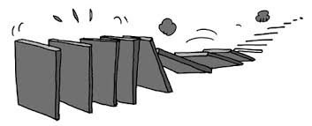

# 자바스크립트 이벤트(Event)

## 이벤트(event)

이벤트(event)는 말 그대로 어떤 사건을 의미한다. 브라우저에서의 이벤트가 발생한다는 것은 사용자가 마우스로 클릭했을 '때', 스크롤을 했을 '때', 필드의 내용을 바꾸었을 '때'와 같은 것을 의미한다.

## 이벤트 type

이벤트의 종류를 의미한다. resize, scroll, click 등. 브라우저는 사용자의 행동에 따라서 이미 약속되어 있는 이벤트를 제공한다.

- UI Event
- Keyboard Event
- Mouse Event
- Focus Event
- Form Event

자세한 사항은 [Event reference](https://developer.mozilla.org/en-US/docs/Web/Reference/Events)에서 확인할 수 있다.

## 이벤트 핸들링(Event Handling)

이벤트가 발생했을 때 동작하는 코드를 의미한다. 각 이벤트 기능에 맞도록 올바른 함수명을 작성해야 한다.

## 이벤트 등록하기

이벤트 프로그래밍을 하기 위해서는 이벤트의 대상에 이벤트 핸들러를 등록해줘야 한다. 웹 브라우저에서는 아래와 같은 방법을 제공한다.

- HTML 이벤트 핸들러 방식 (인라인)

  ```js
  <input type="button" onclick="alert('Hello world');" value="button" />

  // 인라인 방식은 HTML의 정보로서의 가치를 저하시킬 수 있는 요인이므로 자주 사용되는 방법은 아니다.
  ```

  > Angular, React, Vue.js와 같은 프레임워크 alc 라이브러리에서는 인라인 이벤트 핸들러 방식으로 이벤트를 처리한다. HTML, CSS, 자바스크립트를 뷰(View)를 구성하기 위한 구성 요소로 보기 때문이다.

- 프로퍼티 리스너 방식

이벤트 대상에 해당하는 객체의 프로퍼티로 이벤트를 등록하는 방식이다.

```js
let btn = document.querySelector("#myBtn");

btn.onclick = function () {
  console.log("Hi there");
};

btn.onclick = function () {
  console.log("Hi again");
};
```

- addEvntListener 메서드


```js
let btn = document.querySelector("#myBtn");

function event1() {
  console.log("Hi Codeit!");
}

function event2() {
  console.log("Hi again!");
}

// elem.addEventListener(event type, handler)
btn.addEventListener("click", event1);
btn.addEventListener("click", event2);

// elem.removeEventListener(event type, handler)
btn.removeEventListener("click", event2);
```

- 이벤트가 발생하는 요소에 대해 여러 개의 이벤트 핸들러를 추가할 수 있다.

- 캡처링과 버블링을 지원한다.
  - 세 번째 인자에 true를 설정하면 `캡처링`으로 전파되는 이벤트를 캐치한다.
  - default 값(false)으로 설정하면 `버블링`으로 전파되는 이벤트를 캐치한다.

addEventListener 메서드의 두 번째 인자는 함수명을 그대로 작성해야 한다. `event1()`처럼 중괄호를 함께 작성하면 해당 함수가 즉시 실행되기 때문에 **함수명만 작성해야한다.**

위의 예제에서 함수명만 작성하게 되는 것은 **버튼이 클릭되었을 때, 이 함수를 호출하자.** 라는 것. 함수를 바로 즉시 호출하지 않았다는 것이다.

## 이벤트 객체

이벤트를 제대로 다루려면 어떤 일이 일어났는지 상세히 알아야 한다. 예를 들어 `click` 이벤트가 발생했을 때, 마우스 포인터는 어디에 있는지. `keydown` 이벤트가 발생했을 때, 어떤 키가 눌렸는지 등. 상세한 정보를 필요로 한다.

이벤트가 발생하면 브라우저는 이벤트 객체(event object)를 생성한다. 이벤트 객체 프로퍼티에는 이벤트에 관한 상세한 정보가 담겨져 있으며 이벤트를 처리할 수 있는 이벤트 핸들러에 인자로 전달된다.

아래는 이벤트 객체로부터 포인터 좌표 정보를 얻어내는 예시임.

```js
<input type="button" value="클릭해 주세요." id="elem">

<script>
  elem.onclick = function(event) {
    // 이벤트 타입과 요소, 클릭 이벤트가 발생한 좌표를 보여줌
    alert(event.type + " 이벤트가 " + event.currentTarget + "에서 발생했습니다.");
    alert("이벤트가 발생한 곳의 좌표는 " + event.clientX + ":" + event.clientY +"입니다.");
  };
</script>
```

- event 객체를 전달받을 첫 번째 매개변수를 필수로 작성해야 함. 위에서는 event라는 이름으로 매개변수를 지정하였으나, e와 같은 이름을 사용해도 되고 자유롭게 지정할 수 할 수 있다.
- [Event Object 프로퍼티 더 보기](https://developer.mozilla.org/en-US/docs/Web/API/Event)

# 이벤트 흐름 (Event Flow)

<center>



</center>

계층적인 구조에 포함된 HTML 요소에 이벤트가 발생할 경우 도미노와 같은 연쇄적 반응이 일어난다. 즉, 이벤트가 전파(Event Propagation)되는데 전파 방향에 따라서 버블링(Event Bubbling)과 캡처링(Capturing)으로 구분할 수 있다.

표준 [DOM 이벤트](https://www.w3.org/TR/DOM-Level-3-Events/)에서 정의한 이벤트 흐름엔 3가지 단계가 있다.

- 캡처링 단계 - 이벤트가 상위에서 하위 요소로 전파되는 단계
- 타깃 단계 - 이벤트가 실제 타깃 요소에 전달되는 단계
- 버블링 단계 - 이벤트가 하위에서 상위 요소로 전파되는 단계

### 이벤트 흐름인 버블링과 캡처링은 둘 중에 하나만 발생하는 것이 아니라 `캡처링`부터 시작해서 `버블링`으로 종료된다.

### Event Flow는 캡처링 - 타깃 - 버블링 단계

## 이벤트 버블링(Event Bubbling)

```html
<form onclick="alert('form')">
  FORM
  <div onclick="alert('div')">
    DIV
    <p onclick="alert('p')">P</p>
  </div>
</form>
```

위의 코드는 `form > div > p` 형태로 중첩된 구조이다. 요소 각각에는 핸들러가 할당되어 있고 가장 안쪽의 `<p>` 태그를 클릭하면, `onclick` 핸들러가 동작하고 이어서 외부의 `<div>`에 할당된 핸들러 그리고 마지막으로는 `<form>`에 할당된 핸들러가 동작한다. 최상위의 `document` 객체를 만날 때까지 각 요소에 할당된 `onclick` 핸들러가 동작한다.

이런 이벤트 흐름 때문에 `<p>` 태그를 클릭하면, `p -> div -> form` 순서로 세 개의 alert 창이 뜨는 것이다.

이런 흐름을 `이벤트 버블링`이라고 하는데 이벤트가 가장 내부에 있는 요소부터 시작해서 부모 요소까지 거슬러 올라가면서 발생하는 모양이 마치 물속의 거품(bubble)과 닮았기 때문이다.

- 거의 모든 이벤트는 버블링 된다.
- cf. focus 이벤트와 같이 버블링 되지 않는 이벤트도 있음.

**event.target**

이벤트가 발생한 가장 안쪽의 요소는 타깃(target) 요소라고 불리고 `event.target`을 통해 접근할 수 있다.

**cf. event.target과 this(=event.currentTarget)의 차이**

간단하게 정리해서 `event.currentTarget`은 이벤트 핸들러가 부착된 부모 요소를 반환하고 `event.target`은 부모로부터 이벤트가 위임되어 발생하는 자식의 위치, 즉 내가 직접 클릭한 자식 요소를 반환하는 것이다.

## 이벤트 캡처링(Event Capturing)

이벤트 캡처링은 이벤트 버블링과 반대로 진행되는 이벤트 전파 방식이다. 캡처링을 언제, 왜 쓸까? 하는 의문이 있지만 현재로서는 잘 모르겠다. 종종 유용할 경우가 있다고 하니 개념 정리는 하고 넘어가자.

표준 [DOM 이벤트](https://www.w3.org/TR/DOM-Level-3-Events/)에서 정의한 이벤트 흐름엔 3가지 단계가 있다.

- 캡처링 단계 - 이벤트가 상위에서 하위 요소로 전파되는 단계
- 타깃 단계 - 이벤트가 실제 타깃 요소에 전달되는 단계
- 버블링 단계 - 이벤트가 하위에서 상위 요소로 전파되는 단계


위의 사진에서 `<td>`를 클릭하면 이벤트가 최상위에서 시작해서 아래로 전파되고(캡처링 단계) 이벤트가 타깃 요소에 도착해서 실행된 후(타깃 단계), 다시 위로 전파된다(버블링 단계). 해당 과정을 통해 요소에 할당된 이벤트 핸들러가 실행된다.

addEventListener 메서드의 세 번째 인자로 들어오는 capture 옵션으로 캡처링 단계의 이벤트를 캐치할 수 있다.

**요약**

1. 이벤트가 발생하면 이벤트가 발생한 가장 안쪽 요소가 `event.target`이 된다.

2. 이벤트는 `document`에서 시작해 DOM 트리를 따라서 `event.target`까지 내려간다. 이벤트는 트리를 따라 내려가면서 `addEventListener(..., true)`로 할당한 핸들러를 동작시킨다.
3. 타깃 요소의 `event.target`의 핸들러가 호출된다.
4. 이벤트가 `event.target`부터 시작해서 다시 최상위 노드로 전달되면서 각 요소에 할당한 핸들러를 동작시킨다.
   - addEventListener로 할당한 핸들러 중, 세 번째 인자가 없거나 `false`, `{capture:false}`인 핸들러만 호출된다.

각 핸들러는 아래와 같은 `event` 객체의 프로퍼티에 접근할 수 있다.

- event.target - 이벤트가 발생한 가장 안쪽의 요소
- event.currentTarget (=this) - 핸들러가 실제 할당된 요소
- event.eventPhase - 현재 이벤트의 흐름 (캡처링 1, 타깃 2, 버블링 3)

event.stopPropagation()을 사용해 이벤트 버블링을 멈출 수는 있지만, 잘 사용하지는 않는다.

캡처링 단계는 거의 쓰이지 않고, 주로 버블링 단계의 이벤트만 다뤄진다. Why ? 현실에서 사고가 났다고 가정을 해보자. 사고가 발생하면 지역 경찰이 먼저 사고를 조사한다. (이벤트 발생) 그 지역에 대해 가장 잘 아는 기관은 지역 경찰이기 때문이다. (event.target) 추가 조사가 필요하다면 그 이후에 상위 기관이 사건을 넘겨 받는다. (버블링)

**이벤트 위임(Event Delegation)**

이벤트 위임은 이벤트 핸들링 패턴이다.

```html
<ul id="post-list">
  <li id="post-1">Item 1</li>
  <li id="post-2">Item 2</li>
  <li id="post-3">Item 3</li>
  <li id="post-4">Item 4</li>
  <li id="post-5">Item 5</li>
</ul>
```

위의 예제 코드에서 클릭 이벤트가 반응하는 처리를 하고 싶은 경우, li 요소에 이벤트 핸들러를 바인딩하려면 총 5개의 이벤트 핸들러를 바인딩해야 한다.

```js
function printId() {
  console.log(this.id);
}

document.querySelector("#post-1").addEventListener("click", printId);
document.querySelector("#post-2").addEventListener("click", printId);
document.querySelector("#post-3").addEventListener("click", printId);
document.querySelector("#post-4").addEventListener("click", printId);
document.querySelector("#post-5").addEventListener("click", printId);
```

만약 li 요소가 100개라면 100개의 이벤트 핸들러를 바인딩 해야 한다. 이는 속도 저하의 원인이 될 뿐만 아니라 코드 가독성적인 측면에서도 좋지 않다. 또한 동적으로 li 요소가 추가되는 경우, 아직 추가되지 않은 요소는 DOM에 존재하지 않기 때문에 핸들러를 바인딩 할 수 없다.

항상 Why? 를 생각하면서 접근해 보자. 이벤트 위임 패턴은 굳이 왜 생겼을까? 모든 기술과 접근법은 문제를 보다 쉽고 편리하게 해결하려고 하기 위함일 것이다. 이벤트 위임 또한 마찬가지이다.

각각의 자식 요소에 이벤트 핸들러를 바인딩하지 않고 부모 요소`(ul#post-list)`에 단 하나의 이벤트 핸들러를 할당해서 이를 다 다룰 수 있다면? 편리함과 동시에 가독성 측면에서도 훌륭할 것이다. 이게 바로 이벤트 위임이다.

DOM 트리에 새로운 li를 추가하더라도 이벤트 처리는 부모 요소인 ul 요소에 위임되었기 때문에 새로운 요소를 바인딩하지 않아도 된다.

결국 **이벤트 위임**이 가능한 이유는 **이벤트 흐름**에 의해 이벤트를 발생시킨 요소의 부모 요소(버블링)에도 영향을 미치기 때문에 가능한 것이다.

- 상위 요소에 할당된 핸들러에서 event.target으로 실제 이벤트가 발생한 곳을 추적하고 이를 통해 이벤트를 핸들링한다.
