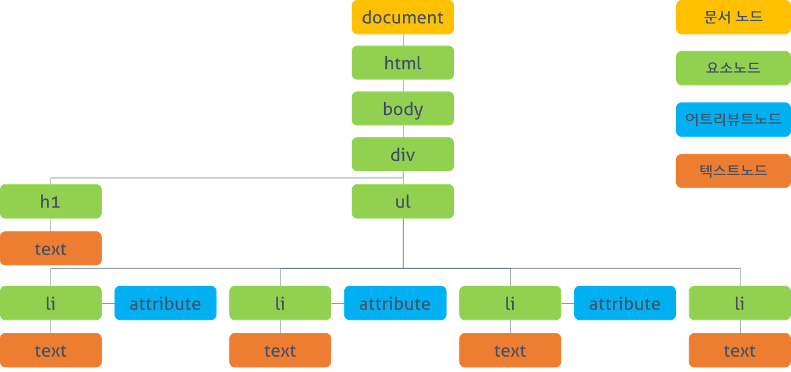
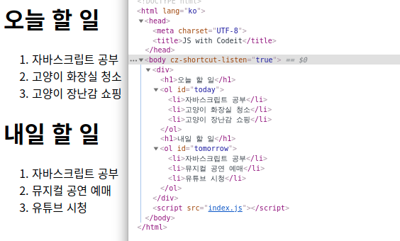

# DOM(Document Object Model)

> DOM(문서 객체 모델 : Document Object Model)

텍스트 파일로 만들어져 있는 웹 문서를 브라우저에 렌더링하려면 웹 문서를 브라우저가 이해할 수 있는 구조로 메모리에 올려야 한다. 브라우저의 렌더링 엔진은 웹 문서를 로드한 후, 파싱하여 웹 문서를 브라우저가 이해할 수 있는 구조로 구성하여 메모리에 적재하는 데 이를 DOM이라고 한다. 즉, **모든 요소와 요소의 속성, 텍스트를 각각의 객체로 만들고 이들 객체를 부모 관계로 표현할 수 있는 트리 구조로 구성한 것이 DOM이다.** DOM은 자바스크립트를 통해 동적으로 변경할 수 있으며 변경된 DOM은 렌더링에 반영된다.


<center>브라우저는 웹 문서(HTML, XML, SVG)를 로드한 후, 파싱하여 DOM을 생성한다.</center>

DOM은 자바스크립트가 자신에게 접근해서 수정하는 방법을 제공하는데 이를 DOM API(Application Programming Interface)라고 부른다. 이 말인즉슨 정적인 웹 페이지에 접근하여 동적으로 웹 페이지를 변경하기 위한 방법은 메모리상에 존재하는 DOM을 변경하는 것이고, 이때 필요한 것이 DOM에 접근하고 변경하는 프로퍼티와 메서드의 집합인 DOM API이다.

DOM은 아래와 같은 두 가지 기능을 한다.

**HTML 문서에 대한 모델 구성**

- 브라우저는 HTML 문서를 로드한 후 해당 문서에 대한 모델을 메모리에 생성한다. 이때 모델은 객체의 트리로 구성되는데 이것을 DOM tree라 한다.

**HTML 문서 내의 각 요소에 접근 및 수정**

- DOM은 모델 내의 각 객체에 접근하고 수정할 수 있는 프로퍼티와 메소드를 제공한다. DOM이 수정되면 브라우저를 통해 사용자가 보게 될 내용 또한 변경된다.

# DOM tree



문서를 객체화 한 DOM의 구조가 나무가 뿌리를 내리듯이 위에서 아래로 뻗는 형태로 되어 있는데 이것을 나무에 비유해서 DOM tree라고 부른다.

## 노드(Node)

앞에서 DOM은 모든 요소, 속성, 텍스트 등을 객체화한 것이라고 했다. 이때 각각의 객체를 노드(Node)라고 칭한다. 모든 DOM은 Node 객체를 상속 받는다.

아래의 코드로 노드 타입을 확인할 수 있다.

```js
for (let key in Node) {
  console.log(key, " = " + Node[key]);
}

ELEMENT_NODE = 1;
ATTRIBUTE_NODE = 2;
TEXT_NODE = 3;
CDATA_SECTION_NODE = 4;
ENTITY_REFERENCE_NODE = 5;
ENTITY_NODE = 6;
PROCESSING_INSTRUCTION_NODE = 7;
COMMENT_NODE = 8;
DOCUMENT_NODE = 9;
DOCUMENT_TYPE_NODE = 10;
DOCUMENT_FRAGMENT_NODE = 11;
NOTATION_NODE = 12;
```

다양한 노드 타입이 존재하지만, 주로 사용되는 노드 타입은 요소 노드와 텍스트 노드이다.

- 문서 노드 (Document Node) : DOM tree의 최상위 노드

  - 각각의 요소, 속성, 텍스트 노드에 접근하려면 문서 노드를 통해야 함.

- 요소 노드 (Element Node) : HTML 태그를 표현하는 노드

  - ex. `<body>, <h1>, <p>` 등과 같은 각종 tags

- 어트리뷰트 노드(Attribute Node) : HTML 요소의 속성을 표현하는 노드

  - ex. `class="funEdges"`

- 텍스트 노드 (Text Node) : 문자를 표현하는 노드
  - ex. `<h1> tag 내부의 안녕하세요` 와 같이 줄바꿈과 공백을 포함한 HTML 문서 내의 텍스트 문자
  - 요소 노드의 자식 요소가 되며 따로 자식 노드를 가질 수 없다.
  - 이를 나무의 잎사귀에 비유해서 leaf node라고 부르기도 한다.

## DOM 접근 메서드

id 속성으로 노드 선택하기

```js
document.getElementById("id");
// 하나의 id tag를 선택할 때 사용된다.
```

class 속성으로 노드 선택하기

```js
document.getElementsByClassName("class");
// 여러 tag를 한 번에 선택할 때 사용된다.
```

css 선택자로 노드 선택하기

```js
document.querySelector("(#, .) css selector");
// 하나의 요소 선택
document.querySelectorAll("(#, .) css selector");
// 여러 개의 요소 선택
```

## DOM 이동 시 활용 가능한 탐색 프로퍼티

탐색 프로퍼티를 사용하면 이웃 노드로 바로 이동할 수 있다.

- 모든 노드에 적용 가능

  |       프로퍼티       |   유형    |                       결과                       |
  | :------------------: | :-------: | :----------------------------------------------: |
  |   node.childNodes    | 자식 노드 |         node의 자식 노드 모음(NodeList)          |
  |   node.firstChild    | 자식 노드 |          node의 첫 번째 자식 노드 하나           |
  |    node.lastChild    | 자식 노드 |           node의 마지막 자식 노드 하나           |
  |   node.parentNode    | 부모 노드 |              node의 부모 요소 하나               |
  | node.previousSibling | 형제 노드 | node의 이전(previous) 혹은 좌측에 있는 노드 하나 |
  |   node.nextSibling   | 형제 노드 |   node의 다음(next) 혹은 우측에 있는 노드 하나   |

- 요소 노드에만 적용 가능

  |            프로퍼티            |      유형      |                        결과                         |
  | :----------------------------: | :------------: | :-------------------------------------------------: |
  |        element.children        | 자식 요소 노드 |      element의 자식 요소 모음(HTMLCollection)       |
  |   element.firstElementChild    | 자식 요소 노드 |          element의 첫 번째 자식 요소 하나           |
  |    element.lastElementChild    | 자식 요소 노드 |           element의 마지막 자식 요소 하나           |
  |     element.parentElement      | 부모 요소 노드 |              element의 부모 요소 하나               |
  | element.previousElementSibling | 형제 요소 노드 | element의 이전(previous) 혹은 좌측에 있는 요소 하나 |
  |   element.nextElementSibling   | 형제 요소 노드 |   element의 다음(next) 혹은 우측에 있는 요소 하나   |

# HTML 콘텐츠 조작

HTML 문서를 객체로 표현한 DOM의 각 노드들은 다양한 프로퍼티를 갖고 있다. HTML 콘텐츠를 조작하기 위해 아래와 같은 메서드를 사용할 수 있다.

## 요소 노드의 주요 프로퍼티

innerHTML 프로퍼티

```js
const myTag = document.querySelector("#list-1");
myTag.innerHTML = "value";
```

- 요소 노드 내부의 HTML 코드를 문자열로 리턴해준다.
- 마크업도 포함된다.

outerHTML 프로퍼티

```js
const myTag = document.querySelector("#list-1");
myTag.outerHTML = "value";
```

- 해당 요소를 포함한 전체의 요소를 HTML 코드를 문자열로 리턴해준다.

textContent 프로퍼티

```js
const myTag = document.querySelector("#list-1");
myTag.textContent = "value";
```

- 요소의 텍스트를 변경한다. textContent를 통해 새로운 텍스트를 할당하면 텍스트를 변경할 수 있다.
- 마크업을 포함하면 문자열로 인식되어 그대로 출력된다.

위의 프로퍼티들은 기존의 요소를 덮어씌우는 방식이었다면, 아래는 요소를 새롭게 추가하는 프로퍼티이다. 이 방법은 다음과 같은 순서에 따라 진행한다.

## DOM 조작 방식 / 요소 노드 추가하기 (만들고, 꾸미고, 추가)



```js
const tomorrow = document.querySelector("#tomorrow"); // 요소에 접근
```

요소 노드 생성

```js
const create = document.createElement("li");
```

- 태그 이름을 인수로 전달하여 요소를 생성

요소 노드 꾸미기

```js
create.textContent = "내용을 추가합니다.";
```

- 요소에 접근하여 innerHTML, textContent 등과 같은 프로퍼티로 내용을 추가한다.

요소 노드 추가하기(Dom tree에 추가되는 것)

```js
tomorrow.append(create);
```

- NODE.prepend() : 메서드를 호출한 노드의 가장 첫 번째 노드로 인수로 전달한 값을 추가한다.
- NODE.append() : 인수로 전달한 값을 메서드를 호출한 노드의 가장 마지막 자식 노드로 추가한다.
- NODE.after() : 인수로 전달한 값 다음의 형제 노드로 추가한다.
- NODE.before() : 인수로 전달한 값 이전의 형제 노드로 추가한다.

> **innerHTML VS DOM 조작 방식**
>
> - 텍스트를 추가 또는 변경시에는 textContent
> - 새로운 요소의 추가 또는 삭제시에는 DOM 조작 방식을 사용
> - innerHTML은 크로스 스크립팅 공격에 취약하다.

## 노드 삭제와 이동하기

노드 삭제하기

```js
const today = document.querySelector("#today");
const tomorrow = document.querySelector("#tomorrow");

// 노드 삭제하기: Node.remove()
tomorrow.remove();
today.children[2].remove();
```

노드 이동하기

```js
// 노드 이동하기: prepend, append, before, after
today.append(tomorrow.children[1]);
tomorrow.children[1].after(today.children[1]);
tomorrow.children[2].before(today.children[1]);
tomorrow.lastElementChild.before(today.children[1]);
```

# HTML 속성 다루기

HTML 태그들이 갖고 있는 속성들은 요소 노드의 프로퍼티가 된다.
하지만 모든 HTML 속성이 요소 노드의 프로퍼티가 되진 않는다. (HTML 속성 표준이 아닌 경우) 요소 노드의 메서드를 사용하면 HTML 태그가 갖고 있는 속성을 다룰 수 있다.

속성에 접근하기 getAttribute ()

```js
tomorrow.getAttribute('href'));
```

속성 추가 및 수정하기 setAttribute ()

```js
tomorrow.setAttribute("class", "list"); // 추가
tomorrow.setAttribute("href", "https://www.codeit.kr"); // 수정
```

속성 제거하기 removeAttribute ()

```js
tomorrow.removeAttribute("href");
tomorrow.removeAttribute("class");
```

## 스타일 다루기

```js
const today = document.querySelector("#today");
const tomorrow = document.querySelector("#tomorrow");

// elem.classList: add, remove, toggle
const item = tomorrow.children[1];
item.classList.add("done"); // 추가
item.classList.remove("done"); // 제거
item.classList.toggle("done", "boolean"); // 토글 메서드는 class 하나만을 다룬다.

// elem.className
today.children[1].className = "done";

// style 프로퍼티
today.children[0].style.textDecoration = "line-through";
today.children[0].style.backgroundColor = "#DDDDDD";
today.children[2].style.textDecoration = "line-through";
today.children[2].style.backgroundColor = "#DDDDDD";
```

기본적으로 style 프로퍼티를 사용해서 요소의 스타일을 직접 수정하는 방법도 있지만, css 파일에 원하는 클래스 파일을 만들어 놓고 자바스크립트로는 클래스 속성을 다루는 방식을 권장한다.
