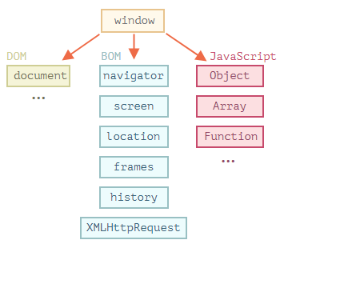

# 브라우저 환경과 호스트

자바스크립트는 본래 `웹 브라우저`에서 사용하려고 만든 프로그래밍 언어이다. `Node.js`의 등장으로 자바스크립트는 웹 브라우저에만 국한되는 것이 아니라 서버 사이드 애플리케이션 개발에도 사용되며 다양한 사용처와 플랫폼을 지원하는 언어로 변모하였다.

자바스크립트가 돌아가는 플랫폼을 `호스트(host)`라고 부른다. 호스트 환경은 기본적으로 코어 언어(ECMAScript)를 제공하며 특정 플랫폼에서 제공하는 객체와 함수를 제공한다.

- EX) 웹 브라우저는 Wep APIs를 제공하고 Node.js는 서버 사이드와 관련된 기능을 제공함. 호스트 환경은 브라우저, 웹 서버 등 심지어는 커피머신이 될 수도 있다.

### 대표적인 호스트인 웹 브라우저

웹 브라우저의 구성 요소들은 하나하나 객체화되어 있다. 자바스크립트로 이 객체를 제어해서 웹 브라우저를 제어할 수 있게 된다. 이 객체들은 서로 계층적인 관계로 구조화되어 있다. BOM과 DOM은 이 구조를 구성하고 있는 가장 큰 틀의 분류라고 할 수 있다.

- **window** :
  `window` 객체는 브라우저 창을 대변하면서 자바스크립트에서 최상단에 존재하는 객체이다. `(브라우저 객체 모델(BOM)에 기반하여 만들어진 최상위 객체)`자바스크립트 코드 어느 곳에서나 항상 접근할 수 있는 객체이기 때문에 전역 객체(global object)라고 부른다. 자바스크립트의 모든 객체, 전역 함수, 전역 변수들은 자동으로 window 객체의 프로퍼티가 된다. 어떤 프로퍼티나 메서드를 사용하든 결국 전역 객체 내부의 것이기 때문에 앞에 window.을 생략할 수도 있다.

  - **DOM(Document Object Model)** : 웹 페이지의 내용을 제어한다. window의 프로퍼티인 document 프로퍼티에 할당된 Document 객체가 이러한 작업을 담당한다.
  - **BOM(Browser Object Model)** : 웹 페이지의 내용을 제외한 브라우저의 각종 요소들을 객체화시킨 것이다. 전역객체 Window의 프로퍼티에 속한 객체들이 이에 속한다.
    - navigator
    - location
    - history
    - XMLHttpRequest
    - screen
  - **JavaScript** : 자바스크립트 언어 자체에 정의되어 있는 객체들이다. (ECMAScript 표준)
